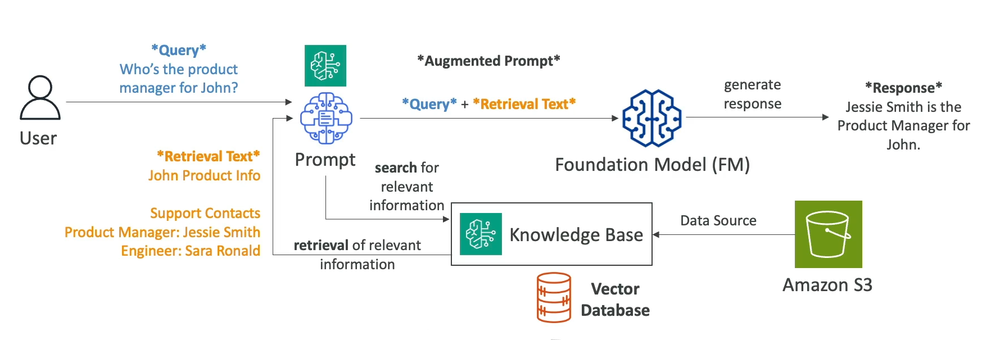
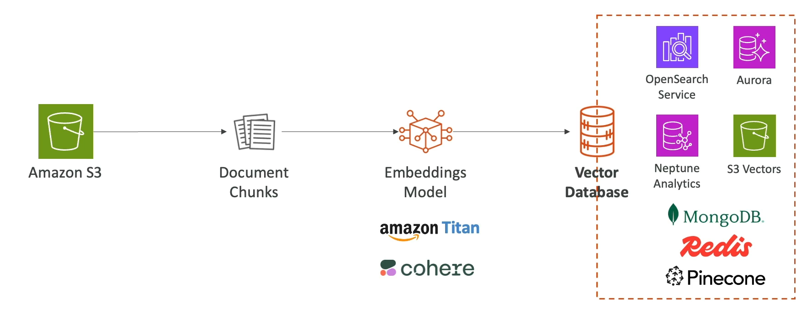
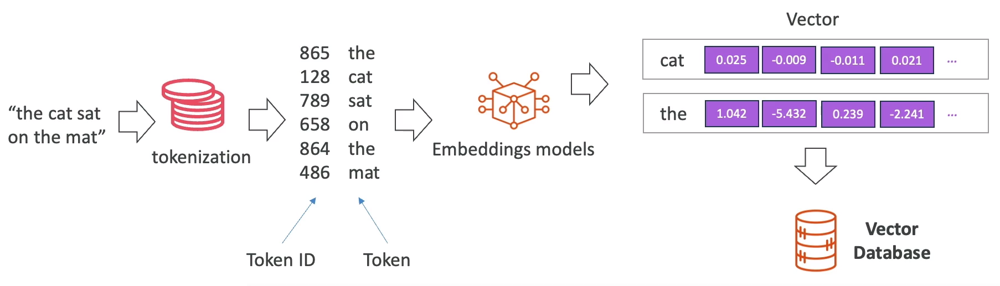
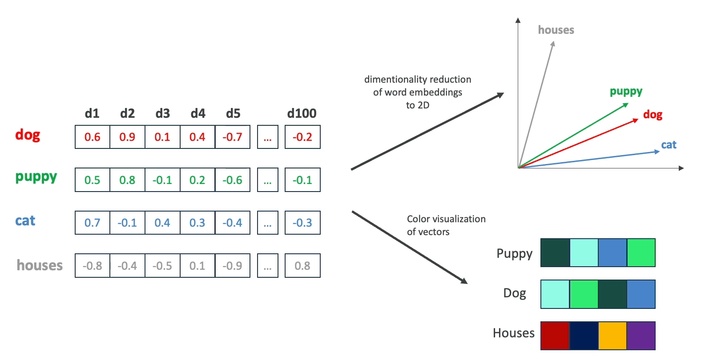

# lkp-chat-demo

## Overview

`lkp-chat-demo` is a .NET 10 ASP.NET Core Web API that implements chat with Retrieval-Augmented Generation (RAG) using AWS services.

The API:
- Stores chats in DynamoDB.
- Retrieves context from an Amazon Bedrock Knowledge Base.
- Uses Amazon Nova for both response generation and query rephrasing.

## Current Architecture (Implemented)

```text
Client
  │
  ▼
ChatController (/api/chats)
  │
  ▼
ChatService
  ├─ IChatRepository (DynamoDbChatRepository -> DynamoDB table: Chats)
  ├─ IRagService (RagService -> Bedrock Agent Runtime Retrieve)
  ├─ IInferenceService (NovaInferenceService -> Bedrock Runtime InvokeModel)
  └─ IRephraseInferenceService (NovaRephraseInferenceService -> Bedrock Runtime InvokeModel)
```

## Request/Response Flow

### Create chat (`POST /api/chats`)
1. Client sends initial user message (`content`).
2. `ChatService` retrieves RAG documents for that message.
3. `ChatService` generates assistant response with Nova.
4. `ChatService` generates a short chat title with Nova.
5. Chat is persisted in DynamoDB with two items: user + assistant.
6. Full `ChatDto` is returned.

### Continue chat (`PUT /api/chats/{chatId}`)
1. Client sends next user message (`content`).
2. Existing chat history is loaded from repository.
3. User intent is rephrased from history + latest message.
4. RAG documents are retrieved using rephrased intent.
5. Assistant response is generated with Nova.
6. User and assistant items are appended and persisted.
7. New assistant `ChatItemDto` is returned.

## API Contracts

### Endpoints

- `GET /api/chats` -> `IEnumerable<ChatSummaryDto>`
- `POST /api/chats` -> `ChatDto`
- `GET /api/chats/{chatId}` -> `ChatDto` (`404` if missing)
- `PUT /api/chats/{chatId}` -> `ChatItemDto` (`404` if missing)
- `DELETE /api/chats/{chatId}` -> `204 No Content`

### Request DTOs

```json
{
  "content": "string"
}
```

Used by:
- `CreateChatDto` (POST)
- `CreateChatItemDto` (PUT)

### Response DTOs

`ChatSummaryDto`

```json
{
  "id": "string",
  "name": "string"
}
```

`ChatDto`

```json
{
  "id": "string",
  "name": "string",
  "items": [
    {
      "id": "string",
      "chatId": "string",
      "content": "string",
      "role": "user|assistant"
    }
  ]
}
```

`ChatItemDto`

```json
{
  "id": "string",
  "chatId": "string",
  "content": "string",
  "role": "user|assistant"
}
```

## Chat Example (Matches Current Model)

```json
{
  "id": "24f2ffa3-6c6d-4da0-9ccc-97d9ce03e7f0",
  "name": "Marvin's feelings",
  "items": [
    {
      "id": "946d5c05-cae2-45db-9bf8-c988603a4603",
      "chatId": "24f2ffa3-6c6d-4da0-9ccc-97d9ce03e7f0",
      "content": "What is Marvin's emotional state?",
      "role": "user"
    },
    {
      "id": "c96be237-5628-4fc9-bc32-108a263361af",
      "chatId": "24f2ffa3-6c6d-4da0-9ccc-97d9ce03e7f0",
      "content": "Marvin expresses utter contempt and horror of all things human...",
      "role": "assistant"
    }
  ]
}
```

## Data Storage Structure

### DynamoDB table
- Table name: `Chats`
- Partition key: `ChatId` (string)
- Stored attributes:
  - `ChatId` (string)
  - `Name` (string)
  - `Items` (list of maps)

Each item in `Items` contains:
- `Id` (string)
- `ChatId` (string)
- `Content` (string)
- `Role` (string)

## Service Interaction Details

- `IRagService` calls Bedrock Knowledge Base `RetrieveAsync` and maps results to:
  - `Text`
  - `Location` (S3 URI)
  - `PageNumber`
  - `Score`
- `IInferenceService` builds message history + context and calls Nova model `eu.amazon.nova-micro-v1:0`.
- `IRephraseInferenceService` resolves follow-up intent before retrieval.

## Current Project Structure

```text
Lkp.Chat.Demo.Api/
  Controllers/
    ChatController.cs
  Dto/
    ChatDto.cs
    ChatItemDto.cs
    ChatSummaryDto.cs
    CreateChatDto.cs
    CreateChatItemDto.cs
  Models/
    BedrockSettings.cs
    FullPrompt.cs
    RagDocument.cs
  Repositories/
    IChatRepository.cs
    Implementation/
      DynamoDbChatRepository.cs
      InMemoryChatRepository.cs (not active; legacy/commented)
  Services/
    IChatService.cs
    IInferenceService.cs
    IRephraseInferenceService.cs
    IRagService.cs
    IPromptService.cs
    Implementation/
      ChatService.cs
      PromptService.cs
      RagService.cs
      Nova/
        NovaInferenceService.cs
        NovaRephraseInferenceService.cs
  Program.cs
```

## Runtime and Dependencies

- Target framework: `.NET 10` (`net10.0`)
- ASP.NET Core Web API
- AWS SDK dependencies for:
  - DynamoDB
  - Bedrock Runtime
  - Bedrock Agent Runtime
- Lambda hosting package is included (`Amazon.Lambda.AspNetCoreServer`).

## Notes

- This repository does **not** currently implement a local document ingestion pipeline (`IIngestionService`, `IEmbeddingService`, `IVectorStore`) as application services.
- Retrieval is delegated to Bedrock Knowledge Base instead of directly managing vectors in this API.

## Reference Diagrams

This README was generated from the diagrams in `docs`:

### RAG Architecture



### Vector Store



### Tokenization



### Embeddings



This solution implements a modern RAG architecture where documents are transformed into embeddings and stored inside a vector database. User questions are converted into vectors, matched against the stored knowledge base, and the retrieved information is injected into the prompt provided to the Foundation Model. The result is a chatbot capable of providing accurate, context-aware answers based on organization-specific data.
